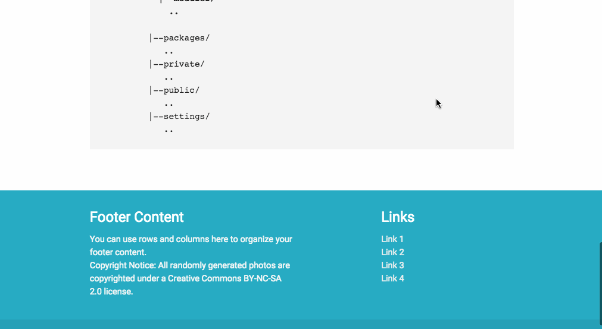

# Meteor Divergent
### A different kind of meteor boilerplate..

####[Available live for your viewing](http://divergent.meteor.com)

## Highlights

### Modularized
Uses modular project structure, with less entangled feature components, enabling more independent module development.

### Materialized
Uses <a href="http://materializecss.com/about.html">Materialize</a> theme built by the awesome students at Carnegie Melon University. Enabled by <a href="https://atmospherejs.com/yang2007chun/materialize-scss">yang2007chun:materialize-scss</a> meteor package.

### Animated
Includes basic page transitions, and element animations enabled by <a href="https://atmospherejs.com/percolate/velocityjs">percolate:velocityjs</a> meteor package.

## Ingredients
Please refer the [list](./.meteor/packages) of packages.
